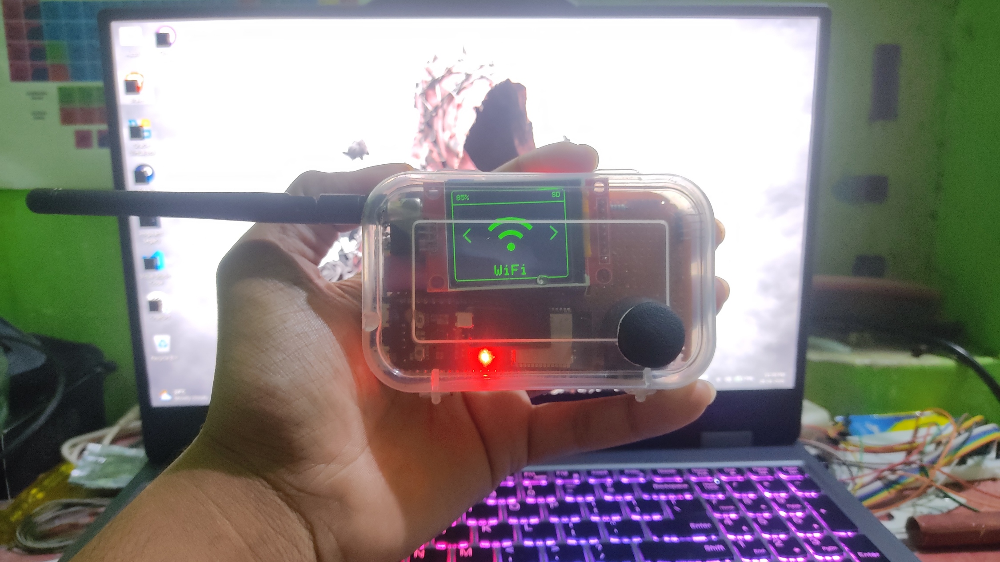
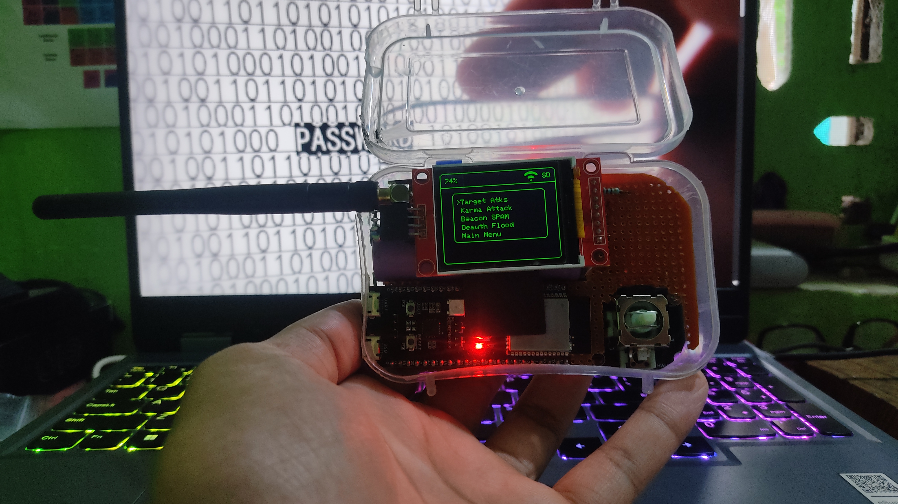
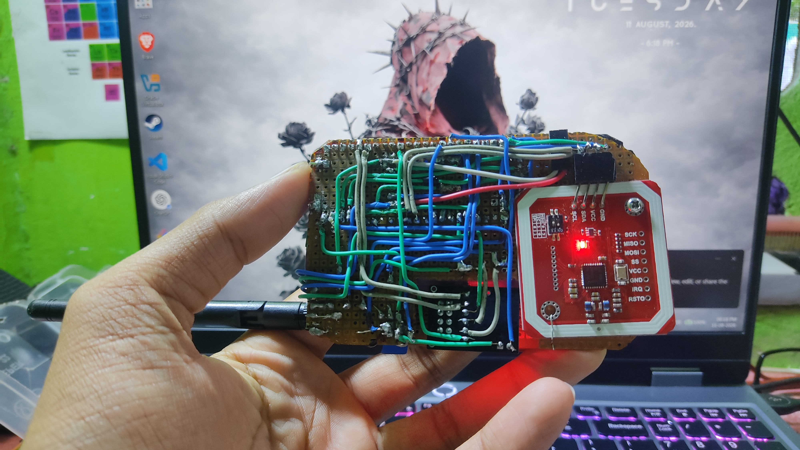
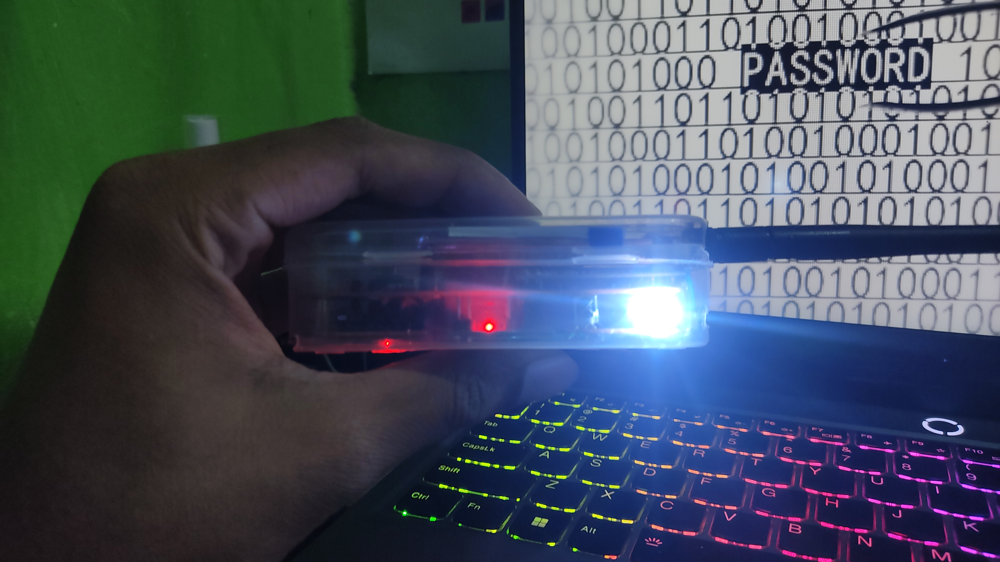
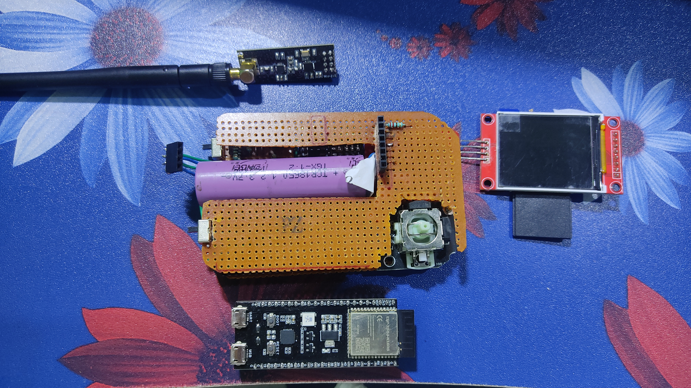
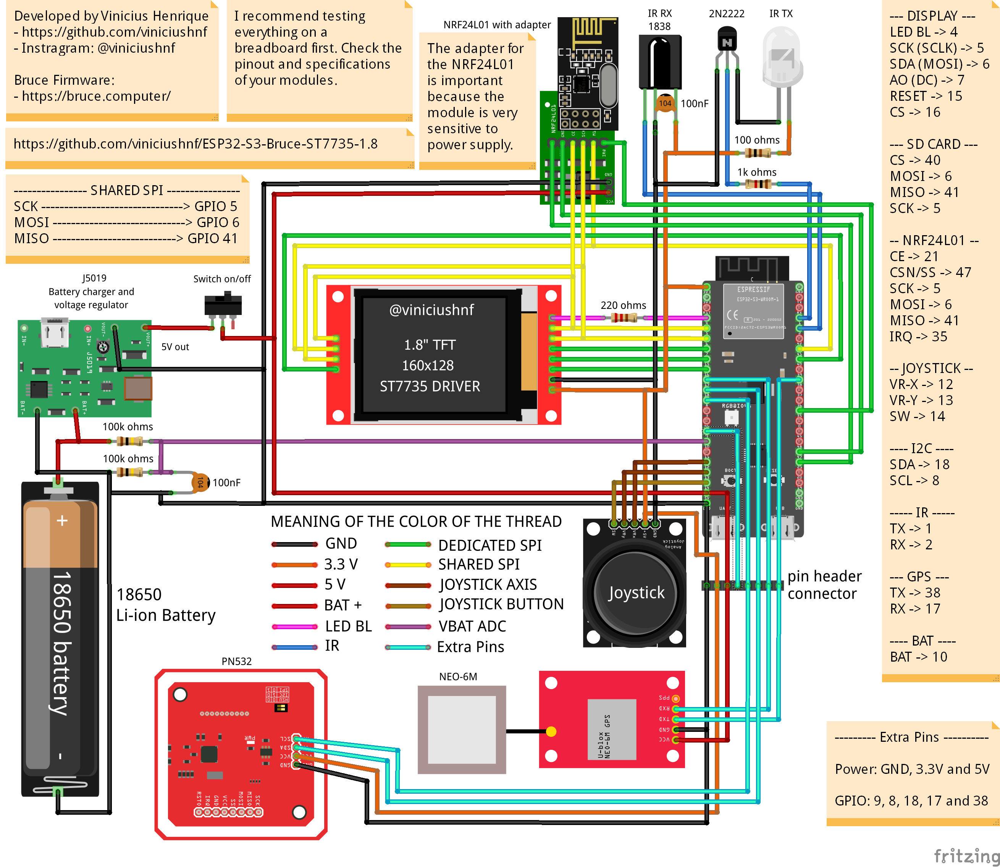

# Bruce ESP32-S3 Portable Device — ST7735 + PSRAM Fix


A custom, portable Bruce Firmware device built around the **ESP32-S3-WROOM-1-N16R8**, with a documented **PSRAM configuration fix** for this specific module.



## 📑 Table of Contents

- [Project](#-project)
- [Features](#-features)
- [PSRAM Fix](#-psram-fix)
- [Hardware Used](#-hardware-used)
- [Wiring Diagram & Documentation](#-wiring-diagram--documentation)
- [Installation](#-installation)
- [Releases](#-releases)
- [Building From Source](#️-building-from-source)
- [Repository Structure](#-repository-structure)
- [Bruce Firmware](#-bruce-firmware)
- [About the Maintainer](#-about-the-maintainer)
- [Support the Original Projects](#-support-the-original-projects)
- [Important Notes](#️-important-notes)
- [Disclaimer](#️-disclaimer)
- [Project Status](#-project-status)

---

## 📸 Project

This project combines an **ESP32-S3-WROOM-1-N16R8** with multiple hardware modules into a compact, portable Bruce Firmware device.

### Main Hardware

* **ESP32-S3-WROOM-1-N16R8**
* **16 MB Flash**
* **8 MB OPI PSRAM**
* **1.8" ST7735 TFT Display**
* **128 × 160 resolution**
* **Joystick**
* **MicroSD card**
* **NRF24L01 + NRF24 adapter**
* **PN532 NFC module**
* **IR transmitter and receiver (TX/RX)**
* **Emergency LED / torch**
* Custom hardware assembly
* Modified Bruce Firmware

The main focus of this repository is the **PSRAM configuration fix** required for the ESP32-S3 N16R8, along with the hardware integration, firmware modifications, and documentation for this particular build.

---

## ⚡ Features

The device runs **Bruce Firmware** and provides the features supported by Bruce for the configured hardware and connected modules.



### ESP32-S3

* ESP32-S3 dual-core microcontroller
* **16 MB Flash**
* **8 MB OPI PSRAM**
* Wi-Fi
* Bluetooth / BLE
* Custom GPIO configuration

### 📡 Wi-Fi

The ESP32-S3 provides the built-in Wi-Fi hardware used by supported Bruce Wi-Fi functionality, including wireless scanning, analysis, and authorized security-testing features.

### 📶 Bluetooth / BLE

* Bluetooth device scanning
* BLE functionality
* Bluetooth testing features supported by Bruce

### 📻 NRF24L01

The device includes an **NRF24L01 module with an adapter** for supported Bruce RF functionality.

* 2.4 GHz RF functionality
* NRF24L01-based RF features
* RF analysis and testing features supported by Bruce

> Available functionality depends on the connected NRF24 hardware and the Bruce Firmware configuration.

### 🪪 NFC — PN532

The device includes a **PN532 NFC module**.



* NFC tag reading
* NFC tag writing
* NFC tag information
* NFC functionality supported by Bruce

### 📡 IR

The device includes an **IR transmitter and receiver (TX/RX)**.

* Infrared signal transmission
* Infrared signal reception
* IR testing functionality supported by Bruce

### 🖥️ Display

* 1.8" ST7735 TFT LCD
* 128 × 160 resolution
* SPI interface
* Custom configuration for this hardware

### 🎮 Joystick

* Menu navigation
* Selection / input control
* Custom GPIO configuration

### 💾 MicroSD

The device includes MicroSD storage for supported Bruce functionality.

* Data storage
* Configuration storage
* File management
* Storage for supported captures and logs

### 🔦 Emergency Torch

A standard LED is included as an **emergency torch / flashlight**.



The LED can be used as a basic source of illumination when required.

### 🔋 Power

The device uses a custom battery-powered hardware configuration with charging and voltage regulation circuitry.

---

## 🐛 PSRAM Fix

The hardware uses an **ESP32-S3-WROOM-1-N16R8** (16 MB Flash, 8 MB OPI PSRAM). Bruce Firmware's default configuration did not correctly initialize/use the available PSRAM for this specific N16R8 configuration.

After correcting the PSRAM configuration for this module:

* Firmware builds successfully
* Firmware flashes correctly
* The device boots
* Bruce Firmware runs
* PSRAM is correctly initialized and usable

This repository documents the fix as applied to this build. Exact modified files/lines will be added here as they're finalized — nothing is invented in advance.

---

## 🔧 Hardware Used

### Main Hardware

* **ESP32-S3-WROOM-1-N16R8**
* **1.8" ST7735 TFT LCD**
* **Joystick module**
* **MicroSD card / SD adapter**
* **NRF24L01 module**
* **NRF24 adapter**
* **PN532 NFC module**
* **IR transmitter (TX)**
* **IR receiver (RX)**
* **Emergency LED / torch**
* **USB UART interface**
* Rechargeable battery
* Battery charging / power regulation circuitry
* On/off switch
* Custom perfboard / hardware assembly
* Connecting wires and headers



### ESP32-S3 Configuration

| Specification      | Configuration           |
| ------------------- | ------------------------ |
| MCU                 | ESP32-S3                 |
| Module               | ESP32-S3-WROOM-1-N16R8    |
| Flash                | 16 MB                     |
| PSRAM                | 8 MB                      |
| PSRAM Type           | OPI / Octal               |
| Display              | 1.8" ST7735                |
| Resolution           | 128 × 160                  |
| Display Interface    | SPI                        |
| Navigation           | Joystick                   |
| Storage              | MicroSD                    |
| NFC                  | PN532                      |
| RF                   | NRF24L01                   |
| IR                   | TX + RX                    |
| Auxiliary Light      | LED                        |

The wiring and original hardware concept are based on the work of **ViniciusHNF**.

Original project:

[ViniciusHNF — ESP32-S3-Bruce-ST7735-1.8](https://github.com/viniciushnf/ESP32-S3-Bruce-ST7735-1.8)

Please refer to the original project for the original hardware design and wiring documentation.

> **Credit:** The original hardware concept and wiring design belong to ViniciusHNF. This repository documents my own build, modifications, PSRAM fix, testing, and documentation.

---

## 📋 Wiring Diagram & Documentation

The wiring diagram below is the original reference diagram by **ViniciusHNF**, used as the basis for this build's wiring:



The full-resolution diagram is available in [`wiring-diagram/`](wiring-diagram/).

Diagram credit: [ViniciusHNF](https://github.com/viniciushnf) — original project: [ESP32-S3-Bruce-ST7735-1.8](https://github.com/viniciushnf/ESP32-S3-Bruce-ST7735-1.8)

---

## 🚀 Installation

The complete step-by-step flashing procedure is provided separately in:

**[installation-guide.txt](installation-guide.txt)**

The guide covers flashing via the [Espressif Web Flasher](https://espressif.github.io/esptool-js/), required flash settings, and the correct USB port to use.

---

## 📦 Releases

The current release provides a single merged `.bin` firmware file, built for this hardware configuration with the PSRAM fix applied.

See the [Releases](../../releases) page for the latest build. Flash settings and the exact flash address are documented per-release in the release notes and in [installation-guide.txt](installation-guide.txt).

---

## 🛠️ Building From Source

This project is built with **PlatformIO**. To build from source:

1. Clone this repository.
2. Open the `bruce-firmware/` folder in PlatformIO (VS Code).
3. Confirm the board/PSRAM configuration matches the ESP32-S3-WROOM-1-N16R8 (16 MB Flash / 8 MB OPI PSRAM) settings documented in this README.
4. Build and flash using PlatformIO, or export the compiled `.bin` and flash it with the Web Flasher as described in [installation-guide.txt](installation-guide.txt).

---

## 📁 Repository Structure

```text
bruce-esp32s3-st7735-psram-fix/
│
├── bruce-firmware/        # Modified Bruce Firmware source
├── images/                 # Build photos
├── wiring-diagram/         # Wiring diagram (original by ViniciusHNF)
├── README.md
├── installation-guide.txt
├── LICENSE
└── .gitignore
```

---

## 🦈 Bruce Firmware

This project uses and modifies **Bruce Firmware**.

* [Bruce Firmware — GitHub](https://github.com/BruceDevices/firmware)
* [Bruce — Official Website](https://bruce.computer/)

Credit to **BruceDevices** and all Bruce Firmware contributors. This repository documents a custom hardware implementation running Bruce Firmware — it does not claim ownership of Bruce Firmware itself.

---

## 👤 About the Maintainer

### FarhanLabs1

I am an Information Technology engineering student interested in **cybersecurity, embedded systems, ESP32 development, electronics, and hardware projects**.

If you find this project useful, you can follow my work on the platforms below.

### 🌐 Find Me Online

* **GitHub:** [FarhanLabs1](https://github.com/FarhanLabs1)
* **YouTube:** [FarhanLabs](https://www.youtube.com/@FarhanLabs)
* **Instagram:** [@FarhanLabs1](https://www.instagram.com/FarhanLabs1/)
* **Instagram:** [@Farhan__4_](https://www.instagram.com/Farhan__4_/)
* **LinkedIn:** [Farhan Shaikh](https://www.linkedin.com/in/farhan-shaikh-80a69b228/)

### 📱 Social Links

**YouTube — FarhanLabs**
Follow the channel for ESP32, cybersecurity, electronics, hardware projects, tutorials, and future builds.

**Instagram — @FarhanLabs1**
Follow for project updates, builds, hardware experiments, and behind-the-scenes content.

**Instagram — @Farhan__4_**
My additional Instagram profile.

**LinkedIn — Farhan Shaikh**
Connect with me for professional updates, projects, cybersecurity, and technology-related work.

If you build this project or modify it for your own hardware, feel free to share your build and tag **FarhanLabs1**.

---

## ⭐ Support the Original Projects

This project builds upon the work of several open-source projects and developers.

If this project helped you build your own device, please consider supporting and following the original projects and their developers.

### ❤️ ViniciusHNF

The original **ESP32-S3 + 1.8" ST7735 Bruce** hardware project that inspired this build.

[GitHub — ViniciusHNF](https://github.com/viniciushnf/ESP32-S3-Bruce-ST7735-1.8)

[ViniciusHNF GitHub Profile](https://github.com/viniciushnf)

### 🦈 Bruce Firmware

This project uses and modifies **Bruce Firmware**.

[Bruce Firmware — GitHub](https://github.com/BruceDevices/firmware)

[Bruce — Official Website](https://bruce.computer/)

Please support the Bruce developers and contributors by visiting the original project, giving it a star, and contributing where possible.

### 👨‍💻 FarhanLabs1

If you like this project or want to see more ESP32, cybersecurity, electronics, and embedded-system projects:

**Follow / Subscribe to FarhanLabs:**

* [YouTube — FarhanLabs](https://www.youtube.com/@FarhanLabs)
* [Instagram — @FarhanLabs1](https://www.instagram.com/FarhanLabs1/)
* [Instagram — @Farhan__4_](https://www.instagram.com/Farhan__4_/)
* [LinkedIn — Farhan Shaikh](https://www.linkedin.com/in/farhan-shaikh-80a69b228/)

If you build this project, **star the repository ⭐, follow the project, and share your build**.

---

## ⚠️ Important Notes

* The PSRAM fix documented here is specific to the **ESP32-S3-WROOM-1-N16R8** (16 MB Flash / 8 MB OPI PSRAM). It is not guaranteed to apply as-is to other ESP32-S3 modules.
* Wiring and hardware design credit belongs to **ViniciusHNF** — this repository documents this specific build, its modifications, and the PSRAM fix.
* Only features that have actually been tested on this hardware are described as working. Bruce Firmware may support additional features not listed here.
* The current firmware release is a single merged `.bin` file — see [Releases](#-releases) and [installation-guide.txt](installation-guide.txt) for flashing instructions.

---

## ⚠️ Disclaimer

This project is provided for **educational, research, development, and authorized security-testing purposes**.

Only use this software and its capabilities on hardware, systems, and networks that you **own or have explicit permission to test**.

Users are responsible for complying with applicable laws, regulations, and policies in their jurisdiction.

---

## 📌 Project Status

**Status:** Working ✅

* **Hardware:** ESP32-S3-WROOM-1-N16R8
* **Flash:** 16 MB
* **PSRAM:** 8 MB OPI
* **Display:** 1.8" ST7735
* **Resolution:** 128 × 160
* **Key modification:** PSRAM configuration fix for N16R8
